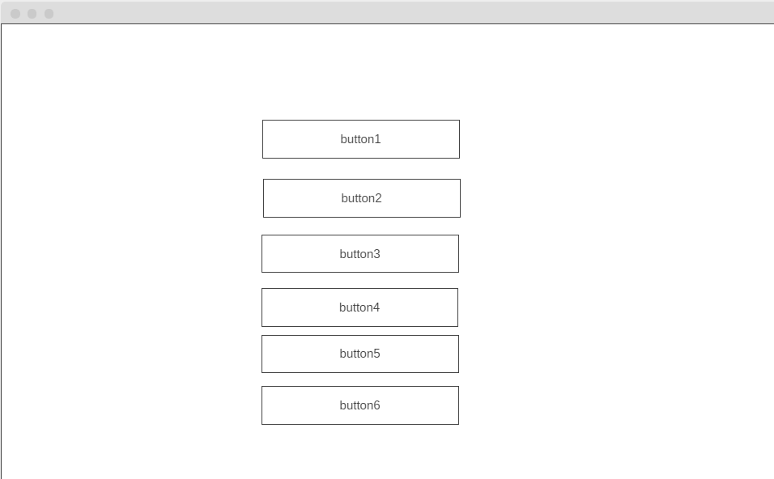

## Development Strategy

  

>  # **Array of number project**

  

write a short description of your project:

- The project is aim is to build simple website with buttons using JS, HTML and CSS.
The project will be developed in a small group by using branches and project board on GitHub.

  

## Wireframe

  

<!-- include a wireframe for your project in this repository, and display it here -->

<!-- wireframe.cc is a good site for getting started with wireframes -->

  

## 0. Set-Up

__A User can see my initial repository and live demo__

### Repo 

- Generate repository from [w3-validation-template](https://github.com/HackYourFutureBelgium/array-of-numbers)

 - Write initial, basic README
 - Create project board 
 - Assign issues according to agreed dev strategy
 - Turn on GitHub Pages

## 1. intro

 *assigned to Fatih*
 *reviewed by Ismail*
  
  - generate reposirty called **Array of number**
  - Create project board
  -  Assign issues 

- [x] developed on a branch called `add-number`

### JS
- write js formula for add number button

## 2. HTML- CSS

*assigned to Gelila*
*reviewed by Iryna*
  
- [x] developed on a branch called `HTML-CSS`
- [x] developed on a branch called `remove-number`
  

### HTML

 - [x] created buttons in HTML
 - [x] title
 - [x] meta's
 - [x] links to css and js files
 
### CSS

- [x] styled buttons
 
### JS

- [x] write js formula for remove number button. 

## 3. all number buttons

*assigned to Iryna*
*reviewed by Fatih*

- [x] developed on a branch called `find-less-than`
- [x] developed on a branch called `find-greater-than`
 
- [x]  Write final, complete README file for project.
    
### JS

- [x] write formula in Js find all number greater than x button.
- [x] write formula in Js find all number less than x button.

## 4. display button

*assigned to Hazem*
*reviewed by Gelila*
- [x] developed on a branch called `display-array`
- [x] write development stratgey for the project.

### JS

- [x] write formula in js display all number button.
  

## Finishing Touches
*assigned to Ismail*
*reviewed by Hazem*

- [x] developed on a branch called `find-average`

### JS

- [x] write formula in js find the average of all numbers button.

-  [makeareadme.com](https://www.makeareadme.com/)

-  [bulldogjob](https://bulldogjob.com/news/449-how-to-write-a-good-readme-for-your-github-project)

-  [meakaakka](https://medium.com/@meakaakka/a-beginners-guide-to-writing-a-kickass-readme-7ac01da88ab3)

- Validate code to check for any last mistakes
